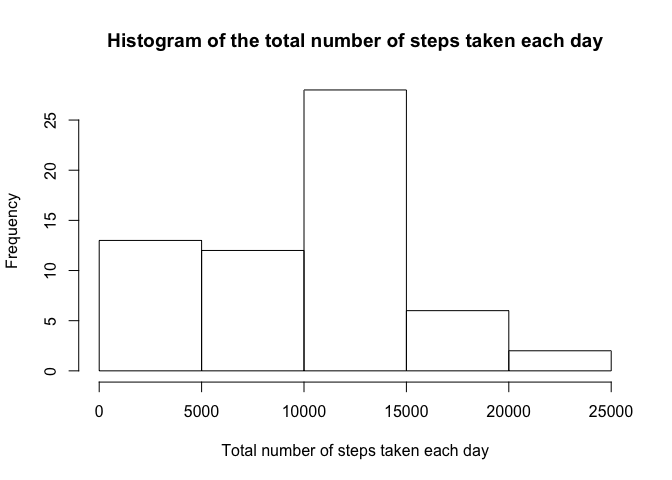

## Loading and preprocessing the data

```r
df <- read.csv("activity.csv")
head(df)
```

```
##   steps       date interval
## 1    NA 2012-10-01        0
## 2    NA 2012-10-01        5
## 3    NA 2012-10-01       10
## 4    NA 2012-10-01       15
## 5    NA 2012-10-01       20
## 6    NA 2012-10-01       25
```


## What is mean total number of steps taken per day?

```r
library(tidyverse)
```

```
## ── Attaching packages ─────────────────────────────────────────────────────── tidyverse 1.3.0 ──
```

```
## ✓ ggplot2 3.3.1     ✓ purrr   0.3.4
## ✓ tibble  3.0.1     ✓ dplyr   1.0.0
## ✓ tidyr   1.1.0     ✓ stringr 1.4.0
## ✓ readr   1.3.1     ✓ forcats 0.4.0
```

```
## ── Conflicts ────────────────────────────────────────────────────────── tidyverse_conflicts() ──
## x dplyr::filter() masks stats::filter()
## x dplyr::lag()    masks stats::lag()
```

```r
day_summary <- df %>%
  group_by(date) %>%
  summarise(sum = sum(steps, na.rm = TRUE))
```

```
## `summarise()` ungrouping output (override with `.groups` argument)
```

```r
hist(day_summary$sum, xlab = "Total number of steps taken each day",
     main = "Histogram of the total number of steps taken each day")
```

<!-- -->

```r
cat("mean: ", mean(day_summary$sum, na.rm = TRUE),
    "\nmedian", median(day_summary$sum, na.rm = TRUE))
```

```
## mean:  9354.23 
## median 10395
```


## What is the average daily activity pattern?

```r
pattern_summary <- df %>%
  group_by(interval) %>%
  summarise(mean = mean(steps, na.rm = TRUE))
```

```
## `summarise()` ungrouping output (override with `.groups` argument)
```

```r
plot(mean ~ interval, data = pattern_summary, type = "l")
```

<!-- -->

- Which 5-minute interval, on average across all the days in the dataset, contains the maximum number of steps?


```r
max <- pattern_summary %>%
  filter(mean == max(pattern_summary$mean))
cat("Interval: ", max[["interval"]], "-", max[["interval"]]+5)
```

```
## Interval:  835 - 840
```


## Imputing missing values

- Calculate and report the total number of missing values in the dataset (i.e. the total number of rows with NAs)

```r
sum(!complete.cases(df))
```

```
## [1] 2304
```

- impute missing values

```r
df_imputed <- df %>%
  group_by(interval) %>%
  mutate(steps = replace(steps, is.na(steps), mean(steps, na.rm = TRUE)))
```

- Make a histogram of the total number of steps taken each day and Calculate and report the mean and median total number of steps taken per day. Do these values differ from the estimates from the first part of the assignment? What is the impact of imputing missing data on the estimates of the total daily number of steps?

```r
day_summary_imputed <- df_imputed %>%
  group_by(date) %>%
  summarise(sum = sum(steps, na.rm = TRUE))
```

```
## `summarise()` ungrouping output (override with `.groups` argument)
```

```r
hist(day_summary_imputed$sum, xlab = "Total number of steps taken each day",
     main = "Histogram of the total number of steps taken each day")
```

<!-- -->

```r
cat("mean: ", mean(day_summary_imputed$sum, na.rm = TRUE),
    "\nmedian", median(day_summary_imputed$sum, na.rm = TRUE))
```

```
## mean:  10766.19 
## median 10766.19
```

- The newly calculated values differ from the estimates from the first part of the assignment
- Imputing missing data makes the distribution of the total daily number of steps more zero-skewed


## Are there differences in activity patterns between weekdays and weekends?

```r
library(ggplot2)
df_weekday <- df_imputed %>%
  mutate(weekend = (weekdays(as.Date(date))=="Saturday" | 
                      weekdays(as.Date(date))=="Sunday")) %>%
  mutate(weekend = fct_recode(as.factor(weekend), 
                              "Weekend" = "TRUE", "Weekday" = "FALSE")) %>%
  group_by(weekend, interval) %>%
  summarise(mean = mean(steps))
```

```
## `summarise()` regrouping output by 'weekend' (override with `.groups` argument)
```

```r
ggplot(data = df_weekday, aes(interval, mean, color = weekend)) + 
  geom_line()
```

<!-- -->

